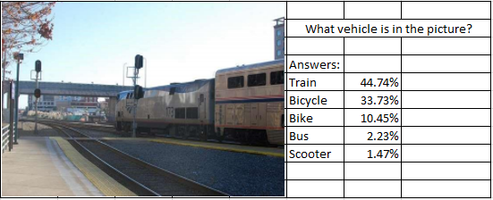
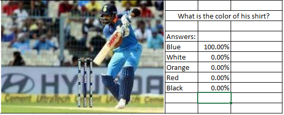

# My work at the Indian Institute of Science, Bangalore as a Research Intern
At IISc, Bangalore - I was involved in two major projects:

## 1. Visual Question Answering using a CNN+BiLSTM architecture
* I implemented multi-domain projects in Computer Vision and Natural Language Processing where I built a Visual Question Answering system based on a CNN and LSTM based architecture. 
* The CNN model worked on extracting the image features while the LSTM worked on extracting the features of the question. 
* When an image and a question about the image were given my model was able to give the correct top-5 answer with an accuracy of 0.56.
* A few examples!

    

    

## 2. Vehicle Detection and Tracking and Lane Detection using Convolutional Neural Networks and Computer Vision
* For Lane Detection:
  * Using a video recording of highway driving, this project's goal is to compute the radius of the curvature of the road. 
  * Curved roads are a more challenging task than straight ones. 
  * To correctly compute the curvature, the lane lines need to be identified but on top of that, the images needs to be undistorted. 
  * Image transformation is necessary for camera calibration and for perspective transform to obtain a bird's eye view of the road.
* For Vehicle Detection and Tracking:
  * Use a deep convolutional network trained on ImageNet as a multi-scale source of features. Typically, VGG, ResNet or Inception
  * Provide a collection of pre-defined anchors boxes tiling the image at different positions and scales. They serve the same purpose as the sliding window approach in classic CV detection algorithms
  * For every anchor box, the modified CNN provides a probability for every class of object (and a no detection probability), and offsets (x, y, width and height) between the detected box and the associated anchor box.
  * The detection output of the network is post-processed using a Non-Maximum Selection algorithm, in order to remove overlapping boxes.
* For a more detailed report: <a href="https://drive.google.com/file/d/1SfvrnFucU_rKqF2tEITfEzOs_tip2qKq/view?usp=sharing"> Click here! </a>

I also did a few mini-projects such as:
* Implementation of the Paper - Convolutional Neural Networks for Sentence Classification – Yoon Kim (2014)
* Implementation of the paper – Deconvolutional Networks for Feature Learning – Zeiler, Fergus (2010)
* Sentiment Analysis on the Yelp Reviews Dataset
* Sentiment Analysis of the Large IMDB Dataset
* Implementation of the paper – Distributed Representations of Sentences and Documents – Le and Mikolov (2014)
* Implementation of paper – Multi-Perspective Sentence Similarity Modelling with Convolutional Neural Networks – He, Gimpel (2015)
* Measuring the similarity of questions on the Quora Question Pairs Dataset
* Classification of Toxic Comments in the Wikipedia Dataset using Convolutional Neural Networks
* Deep Learning Approach to classification of Breast Cancer tumours as Benign or Malignant
* Prediction of Passenger Survival on the Titanic using Machine Learning Techniques
* Credit Card Fraud Detection using Multilayer Perceptron and a comparison to Decision Trees and Naïve Bayes Classifiers
* Prediction of the Onset of Diabetes in patients using Gradient Boosting Classifiers and its comparison with other Boosting algorithms
* Digit Identification from the MNIST dataset using Convolutional Neural Networks
* Seedling Classification using Convolutional Neural Networks
* Google Stock Value Prediction using Linear Regression
* Predicting the effects of Genetic Variations using LightGBM
* Real Time Object Detection using Tensorflow and Protoc Models
* Balancing a pole on a cart problem - Reinforcement Learning
* Acrobot – Making a two-link pendulum go above a certain height - Reinforcement Learning

For a more detailed report on all these projects: <a href="https://drive.google.com/file/d/18v2feaAgssGgx4TIkFaYM334dM7PgVEd/view?usp=sharing"> Click here! </a>

[back](./)
