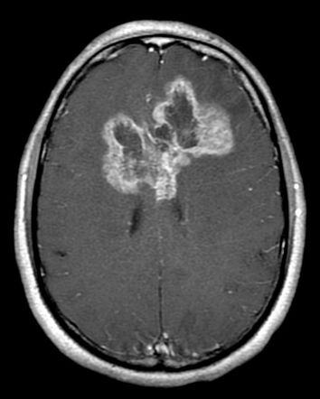

# My work at Mazumdar Shaw Center for Translational Research as a Bioinformatics Intern

    

* I worked on analyzing of Copy Number Variation Data and DNA Methylation   Data for Finding Useful Biomarkers in Glioblastoma Multiforme, which is an aggressive brain cancer. 
* I was able to find 15 significant genetic variations on analyzing 563 patient   samples that help in predicting patient prognosis like ’Time to Death’ and ’Age of Occurrence.’
* Applied a similar analysis pipeline to Lower Grade Gliomas, which are lesser dangerous tumours. 
* I was able to find 12 significant genetic variations on analyzing 958 patient samples that help in predicting patient prognosis like ’Time to Death’, ’Age of Occurrence’ and ’Histological Type.’
* Also contributed to a publication – ‘Recursive Consensus Clustering’ – a novel algorithm designed at the institute by doing algorithm analysis, testing and hosting the visualizations on a website. The paper can be found at - https://www.nature.com/articles/s41598-020-67016-3
* A more detailed report on the work can be found here: <a href="https://drive.google.com/file/d/1elRjedRNR47j6TnM740Lxb_Qs55VntRl/view?usp=sharing"> Click here! </a> 

[back](./)
