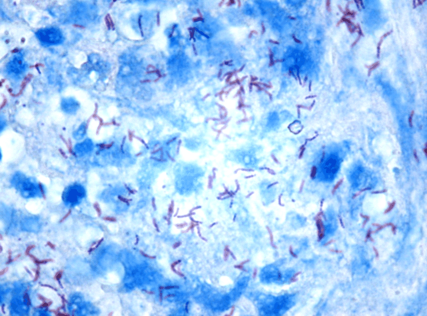

# My work at SigTuple as a Data Science Intern

## Detection and Grading of Tuberculosis from Sputum Smear Microscopy using Deep Learning 

    

* As of 2018, it is speculated that 25% of the world population has been infected with tuberculosis. 
* In 2017, there were more than 10 million cases of active tuberculosis infections which resulted in 1.6 million people deaths. This makes Tuberculosis the deadliest infectious     disease of the current era. More than 95% of these deaths occur in developing countries and more than 50% in India, Indonesia and The Philippines.
* This is mainly because in developed countries, early screening and frequent testing with fast results leads to latent tuberculosis infections being caught early and treated.       However, in countries like India, the ratio of pathologist to patient is very low.
* To work on a solution to this problem, I developed a Deep Learning pipeline to diagnose Tuberculosis on SigTuple’s AI100 and AI101 diagnostic machines - the goal is to reduce     the diagnostic time by almost 90% and improve the accuracy of TB Sputum Smear Test by over 50%.
* I also deployed a pipeline based on the Yolo architecture, which was able to grade FOVs for tuberculosis with an exact match in 161 FOV out of 185 taken from over 15 patients to   the ground-truth established by a certified pathologist. The pipeline is currently in production.
* I was also involved in building a super-resolution pipeline using convolutional autoencoders which was able to increase the resolution of a 40x image to that of a 100x image.     This was required as the pathology machines do not come equipped with 100x lens. It has helped improve the speed and accuracy of annotating the image data by almost 40%, both     for the tuberculosis pipeline and other pipelines in the company.
* A more detailed report on the work can be found here: <a href="https://drive.google.com/file/d/1A2DVV77ExMp7JeK4R97Yo63KUbF2MzTw/view?usp=sharing"> Click here! </a>

